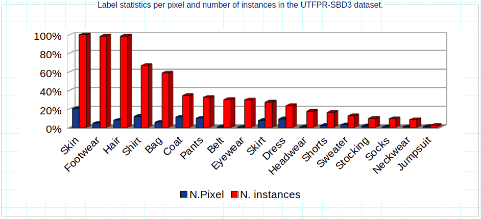

# UTFPR-SBD3 - Federal University of Technology - Paraná - Soft Biometrics Dataset3

## Introduction

Soft biometrics is an emerging area of research, mainly due to its extensive applicability in people surveillance. It is related to human characteristics that can be used for people tracking and identification based on appearance, including physical, behavioral or adhered (such as clothing) features. Semantic segmentation of clothes is still a challenge for researchers because of the wide variety of clothing styles, layering, and shapes. Datasets available for the clothing segmentation task, such as CFPD and Fashionista, are quite small, they have several annotation errors (at the pixel level) and a high unbalanced class distribution. To overcome these problems, we propose a new benchmark, named **UTFPR-SBD3**, containing 4,500 images manually annotated within 18 classes, plus the background.

## Dataset description

This dataset was constructed by combining crawled images from Chictopia.com and images from three existing public datasets: CCP (Clothing Co-Parsing dataset), CFPD (Colorful Fashion Parsing Dataset) and Fashionista dataset.

All images in the dataset are standardized at 400x600 pixels in RGB, and they were manually annotated using the JS Segment Annotator, a free web-based image annotation tool. Clothes were grouped into classes, as follows:


Considering that all images in the dataset were annotated in a per-pixel basis, the plot below shows the proportion of classes and annotated pixels in the dataset.




## Related Papers

If you use of the UTFPR-SDB3 dataset, please cite the following reference in any publications:


A. De Souza Inácio and H. S. Lopes, "EPYNET: Efficient Pyramidal Network for Clothing Segmentation," in IEEE Access, vol. 8, pp. 187882-187892, 2020, doi: 10.1109/ACCESS.2020.3030859.

```
@ARTICLE{9222020,
  author={De Souza Inácio, Andrei and Lopes, Heitor Silvério},
  journal={IEEE Access}, 
  title={EPYNET: Efficient Pyramidal Network for Clothing Segmentation}, 
  year={2020},
  volume={8},
  number={},
  pages={187882-187892},
  doi={10.1109/ACCESS.2020.3030859}}
```


<a rel="license" href="http://creativecommons.org/licenses/by-nc-nd/3.0/"></a><br />This work is licensed under a <a rel="license" href="http://creativecommons.org/licenses/by-nc-nd/3.0/">Creative Commons Attribution-NonCommercial-NoDerivs 3.0 Unported License</a>.
